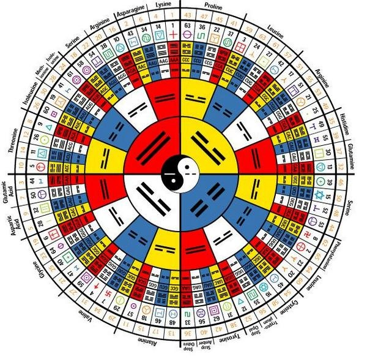
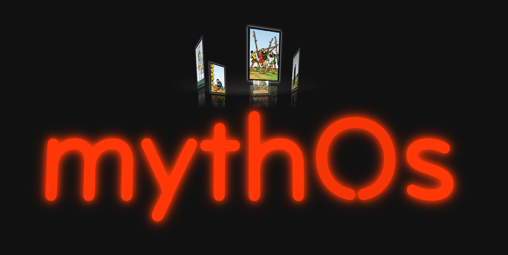
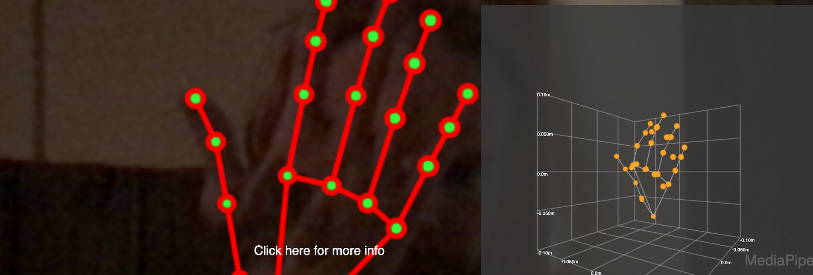

# mythOS
A derived dream from prior hackathon projects aimed at verifiable telegenetic curation and assemblage, through prior-card pulls, hastas ritual, & post life action.

User story: 2 lovers from a far, sync up with hand rituals. They track cards together and learn through Gaia. Their hands touch, and the universe falls away from that moment. They find peace.

# hypothesis & research
An investigate into open infrastructure for UV light and frequencies. It’s a further exploration into the plasticity of the mind, through coupling dark matter and light. Aligns around the phrase by the philospher Flusser, where “cameras are thinking machines”, so as far as thinking with our hands (EthOStep) with cameras as presented, can we develop a computational camera for connection from afar, in wakeful (start) to dreams (end). Software has become more important than hardware. Photographers are thinking as hybrid artists. Ritual hand practitioners equating themselves to causal patterns in mind and body connection, in youth, old age and distant friendships across time and space.

### history analogs
Like how Daguerreotypes modernized the portrait of identity, the project aims to help assemble squads in rhythmic direction, across distances, like that of morse code signatures for communication in energetic forces, but from energy activations derived from tarot oracles.

The intersubjective opinion and truth, routed in cycles of astronomical cycles whereby mappings of cross internet connection might be guided by tarots, and objectively tracked via hardware interfaces, like non-invasive computer devices.

“Oracular systems function through contact wth a kind of hyper time, where events can be observed as hyper dimensional networks. In this context, conventional causality may not be conceivable, and things happen for reasons other than causes." 

This hand selection of altering events through the beliefs and imagination of people may help tune the statement: "Know thyself, nothing in excess." as we begin character communication beginning with long known alphabets (e.g. phoenician, etc.), to something more comprehensible and complete by modern computational standards. 

Aimed as a non-profit.

# myth & timeline
2022 - 23rd as XXII Phoenix release card in NFC Veriable version (Reed)
Releasing 2 cards per year, in summer solstice & winter solstice to a max of 30.

# inspiration
Play card deck <- tarot -> perculated secrets of the arcana

By expanding the scope, might we align micro finite games to the infinite potential of the human collective, as value flow migrates in patterns, like the oceans that dictate our climate.

# UI / UX
### Portal Access

### ENS login
TODO.

### Gaia Tarot Drip
TODO

### Livepeer + Hand Encodings
TODO. Just seeing outlines of our hands, with seletons on the trees, assembling new buidlings with love.

### Gelato network + smart contract activations for unicode swap
On hand gesture with combined p2p state transfer uding fluence, activate unicode swap for resources, like a cross internet handshake.

# meta8
NFC embeded altair as verifiable points in a matrix.
TODO

# services
telephony arcana, jungian archetypal paths: https://twitter.com/Moskalyk/status/1459838700490272769

## previous projects
- Reed: https://showcase.ethglobal.com/unicode/reed
- ArBr: https://showcase.ethglobal.com/ethonline2021/arbr
- Ethostep: https://youtu.be/liHEr4Pn0_Y

